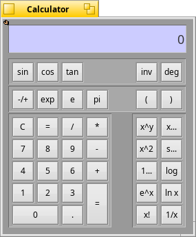

# Calculator



This is a very simple scientific calculator meant as an experiment and learning experience in writing for BeOS. Please send me bugs/questions/gripes, but don't file lawsuits if your taxes do not come out just right!

## How to install

Simply run ```make```.

## How to use

I assume that you are already familiar with handheld calculators, so I'll omit the really basic stuff. Just launch the application and use it. However, there are a few subtle points:

* The <kbd>inv</kbd> button is a modifier that gives the **inverse trig functions**. Click the <kbd>inv</kbd> button followed by one of the three trig buttons (<kbd>sin</kbd> <kbd>cos</kbd> <kbd>tan</kbd>).  The inverse feature resets itself after every single use.

* The <kbd>deg</kbd> button is a toggle that behaves in the classic unintuitive way:  when the button says **deg** the trig functions operate in degrees;  clicking the button changes its label to **rad** and makes trig functions operate in radians.

* The <kbd>C</kbd> button clears the current input.  Clicking <kbd>C</kbd> a second time in a row resets the calculator's stack and input.

### Keyboard shortcuts:
  * The obvious <kbd>0</kbd> ... <kbd>9</kbd> , <kbd>=</kbd> , <kbd>/</kbd> , <kbd>+</kbd> , <kbd>C</kbd> , <kbd>.</kbd> , etc.
  * <kbd>e</kbd> puts you in exponent mode (i.e. type `16.7e6`).
  * <kbd>p</kbd> gives PI.
  * <kbd>~</kbd> (_tilde_) is the "**-/+**" key used for negating a number.
  * <kbd>Enter</kbd> , <kbd>Return</kbd> both activate the "**=**" key.

You may paste text into the calculator (<kbd>command</kbd>+<kbd>V</kbd>). This is currently fine for simple expressions, but it doesn't allow you to enter stuff that doesn't have a keyboard shortcut (see above). Sorry.

You may copy from the calculator (<kbd>command</kbd>+<kbd>C</kbd>). The clipboard will be loaded with both the text representation and the double-precision floating-point representation.

___

#### Brought to you by:

Peter Wagner
pwagner@stanfordalumni.org

 

